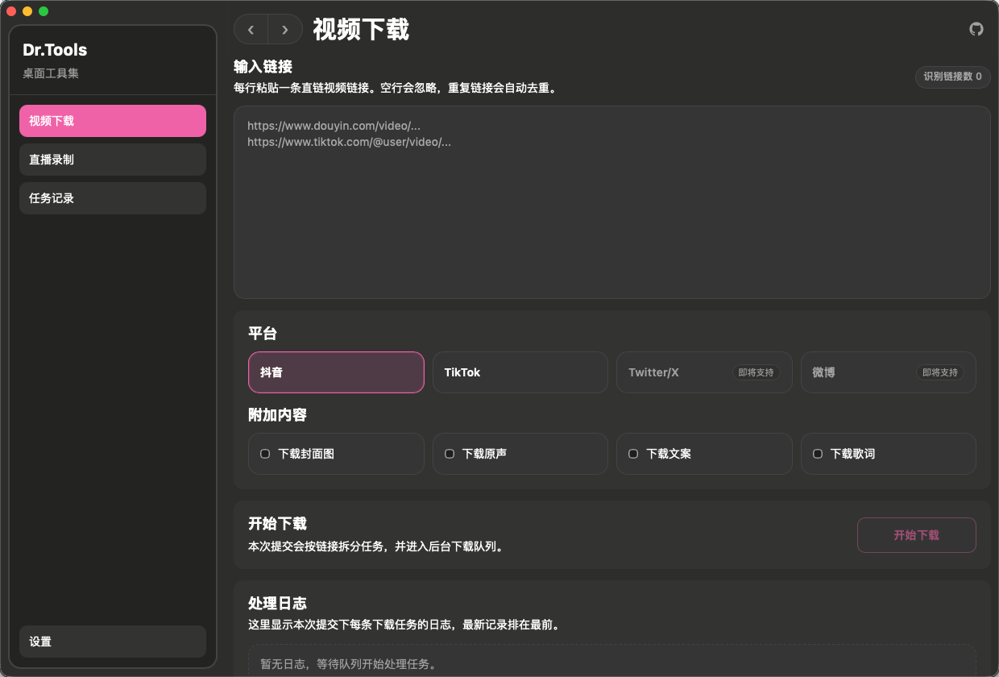
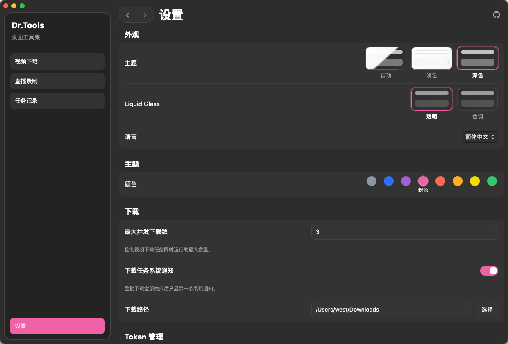
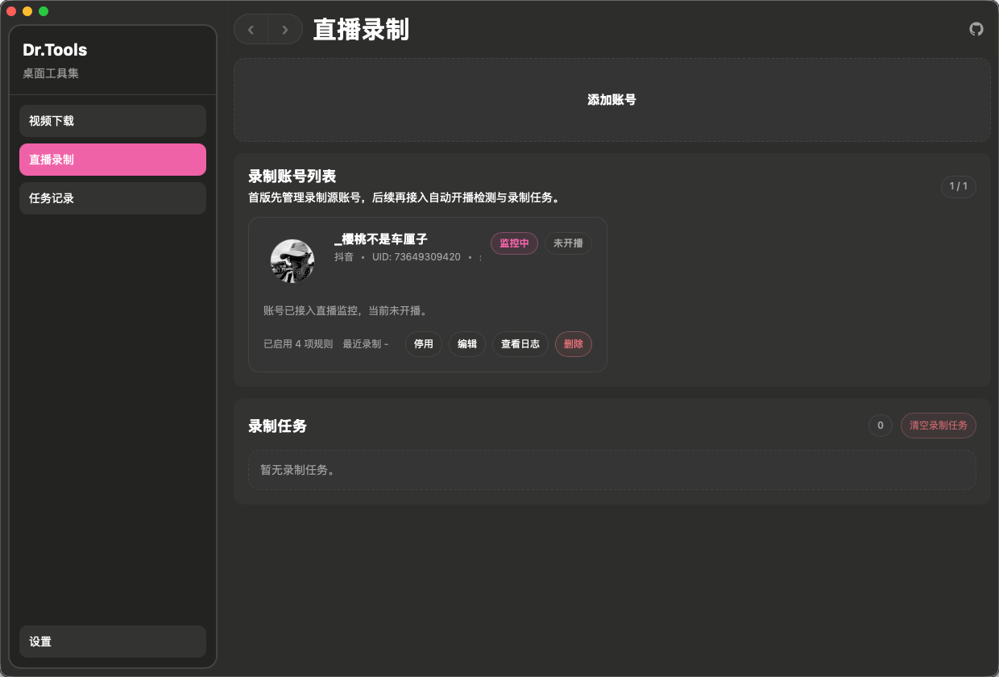

<p align="center">
  
</p>

<h1 align="center">Dr.Tools</h1>

<p align="center">
  A desktop toolbox for creator-focused media workflows.
</p>

<p align="center">
  Desktop App · Video Downloads · Task Management · Settings Management · Tauri Integration
</p>

<p align="center">
  <a href="package.json"></a>
  <a href="src-tauri/Cargo.toml"></a>
  <a href="package.json"></a>
  <a href="LICENSE"></a>
</p>

<p align="center">
  <a href="README.md">简体中文</a> | English
</p>

---

Dr.Tools is a desktop application built with Tauri, Vue, Rust, SQLite, and Python.
It currently focuses on creator media workflows, including video downloads, task tracking, and runtime settings management.

> Note: this project is still under active development, and both features and implementation details may continue to evolve.
>
> The video download and live recording capabilities in this project are integrated and extended from the open-source project [`F2`](https://github.com/Johnserf-Seed/f2). This explicit attribution is intended to respect the original project, follow open-source norms, and reduce unnecessary copyright or ownership ambiguity.

## Features

- Submit video download jobs and process them in batches
- View per-task processing logs
- Manage task history, batch details, and task detail windows
- Configure theme, language, token, and download settings
- Bridge task execution through a Python sidecar
- Send system notifications after batch completion

## Tech Stack

- Vue 3
- TypeScript
- Pinia
- Vue Router
- Vite
- Tauri 2
- Rust
- SQLite
- Python
- f2

## Development

### Requirements

- Node.js 20+
- `pnpm`
- Rust toolchain
- Python 3.12

### Install dependencies

```bash
pnpm install
```

### Start development

```bash
pnpm tauri dev
```

### Validation commands

```bash
pnpm typecheck
pnpm build
pnpm check:desktop
pnpm check
```

## Build and Release

- Added GitHub Actions workflow: `.github/workflows/release.yml`
- Manual build: run the `release` workflow from the GitHub Actions page to generate platform bundles and upload them as workflow artifacts
- Automatic release: push a `v*` tag such as `v0.1.0` to build all targets, create a GitHub Release, and upload installable packages
- Current targets: macOS Apple Silicon, macOS Intel, Linux, and Windows
- If you need production signing later, add the required macOS / Windows signing secrets in the repository settings

## Design System Preview

- Design system document: `DESIGN_SYSTEM.md`
- Static preview page: `design-system-preview.html`
- Usage: open `design-system-preview.html` in the project root directly in a browser
- Maintenance rule: when design rules change, update both `DESIGN_SYSTEM.md` and `design-system-preview.html`

## Project Structure

```text
src/                         Frontend app entry and UI layer
  App.vue                    Application shell and shared title bar
  main.ts                    Frontend bootstrap entry
  bootstrap.ts               App initialization and global error handling
  router/                    Route registration and page entry points
  layouts/                   Shared layout components
  navigation/                Navigation configuration
  modules/                   Frontend modules split by business domain
    download/                Video downloads
    recording/               Live recording
    tasks/                   Task history and detail views
    settings/                Settings and runtime configuration
  api/                       Shared Tauri API wrappers
  stores/                    Global state
  i18n/                      Localization resources
  theme/                     Appearance and theme logic
  lib/                       Shared utility functions
  assets/                    Static assets

src-tauri/                   Desktop host and backend capabilities
  src/
    main.rs                  Tauri application entry
    application/             App state assembly and startup logic
    commands/                Tauri commands exposed to the frontend
    domain/                  Domain models and types
    repositories/            SQLite data access
    services/                Scheduling, Python bridge, and system services
  python/                    Python sidecar entry and task implementations
    core/                    Python dispatching and infrastructure
    tasks/                   Concrete Python tasks
  migrations/                SQLite migration scripts
```

## Notes

- The frontend is organized by business module first, and pages, types, and API bindings should stay as close to each module as possible inside `src/modules/<domain>`.
- Cross-module shared functionality should live in `src/api`, `src/i18n`, `src/lib`, `src/stores`, `src/theme`, and `src/assets`.
- The Rust side follows a `commands -> services -> repositories -> domain` responsibility chain to avoid pushing business details directly into Tauri commands.
- Python `main.py` should remain the protocol entry only, while task dispatching and implementations belong in `src-tauri/python/core` and `src-tauri/python/tasks`.

## UI Preview





## Contributing

Please read `CONTRIBUTING.md` before submitting code.

## Acknowledgements

- Thanks to [`F2`](https://github.com/Johnserf-Seed/f2) for supporting this project.

## License

This project is licensed under the `MIT` License. See `LICENSE` for details.
